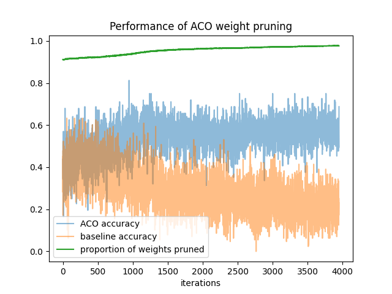

# Ant Colony Optimization for Neural Network parameter pruning

## How-to

In order to perform the weight pruning, please use the *main.py* file. 
1. Set the path to the data for the variable __DATA_PATH__.
2. Specify your network, or use the standard one we provide and do our analysis with.
3. (Adapt the ACO architecture if you use a different network from ours)
4. Choose the parameters for *rho*, *min_acc*, *n_iter* and *n_ants*
5. Run the algorithm

## Dataset and Network

For our analysis, we use the Fashion-MNIST dataset with a 784x16x10 simple NN
with ReLU activation after the input layer. The image is normalized to values between 0 and 1.

## Results

To highlight the performance, we can observe that using 1000 ants, 
we can remove over 95% of the weights, while keeping accuracies close to 60% using 
*min_acc* = 0.6, and *rho* = 0.1. This is much better than randomly removing
parameters as the plot shows.

